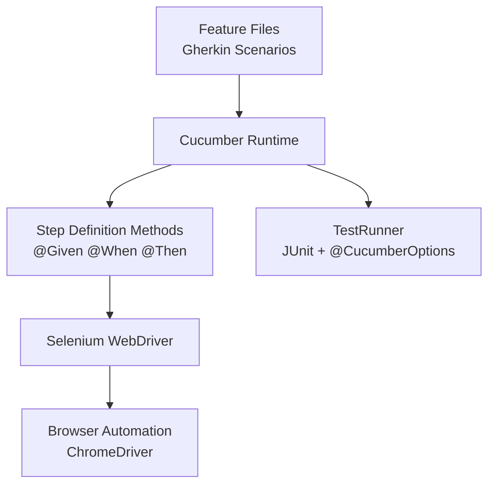
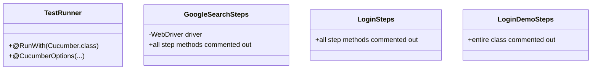
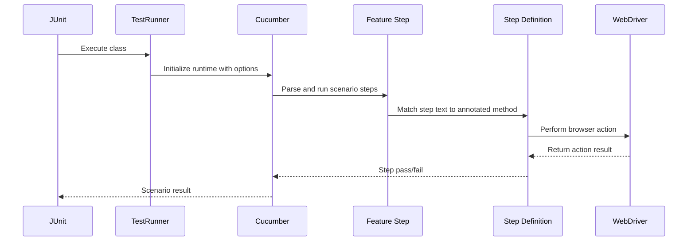

# CucumberJava Test Automation Documentation

## Table of Contents
- [Overview](#overview)
- [Architecture](#architecture)
- [Project Structure](#project-structure)
- [Dependency Reference](#dependency-reference)
- [Behavior Specifications (Feature Files)](#behavior-specifications-feature-files)
- [Step Definition Classes](#step-definition-classes)
- [Test Runner Configuration](#test-runner-configuration)
- [Execution Flow](#execution-flow)
- [How to Run](#how-to-run)
- [Current Gaps and Improvement Opportunities](#current-gaps-and-improvement-opportunities)

## Overview
This repository contains a Java-based BDD (Behavior-Driven Development) test suite using **Cucumber**, **JUnit 4**, and **Selenium WebDriver**. The codebase is designed to map Gherkin feature scenarios to Java step definitions and execute them through a JUnit-powered Cucumber runner.

At present, the actively defined executable scenario is the login demo workflow in `LoginDemo.feature`, while multiple other step definitions and feature files are retained as commented learning/reference examples.

## Architecture



### Why this architecture?
- **Readable test behavior**: Business-readable scenarios are written in `.feature` files.
- **Executable mapping**: Step annotations (`@Given`, `@When`, `@Then`, `@And`) bind text steps to Java methods.
- **Browser automation layer**: Selenium performs real UI interactions.
- **Unified entry point**: `TestRunner` centralizes feature and glue configuration.

## Project Structure

| Path | Purpose |
|---|---|
| `src/test/resources/Features` | Gherkin feature specifications. |
| `src/test/java/StepDefinitions` | Java step definitions and test runner. |
| `src/test/resources/drivers/chromedriver` | Local ChromeDriver binary used by Selenium. |
| `pom.xml` | Maven dependencies for Cucumber, JUnit, and Selenium. |

## Dependency Reference

The Maven project declares these key test dependencies:

| Dependency | Version | Role |
|---|---:|---|
| `io.cucumber:cucumber-java` | `5.7.0` | Cucumber step annotation APIs and runtime integration. |
| `io.cucumber:cucumber-junit` | `5.7.0` | JUnit 4 bridge for running Cucumber features. |
| `junit:junit` | `4.13` | Test execution framework. |
| `org.seleniumhq.selenium:selenium-java` | `4.0.0-alpha-5` | Web UI automation library. |

> Note: `cucumber-junit` appears twice in `pom.xml`, which is functionally redundant and can be cleaned up.

## Behavior Specifications (Feature Files)

### `LoginDemo.feature` (active)
Defines a **Scenario Outline** for login validation with two example credential rows:
- `Given browser is open`
- `And user is on login page`
- `When user enter <username> and <password>`
- `And user clicks on login`
- `Then user is navigated to the home page`

### `GoogleSearch.feature` (commented)
Contains a fully commented scenario for Google search flow; currently non-executable.

### `login.feature` (commented)
Contains commented sample scenarios and outlines for login behavior; currently non-executable.

### `logins.feature`
Currently empty.

## Step Definition Classes



### 1) `GoogleSearchSteps`
- Declares `WebDriver driver = null;`.
- Includes a full Google search workflow implementation, but all step methods are commented.
- Demonstrates browser setup, navigation, element interaction, waits, and teardown patterns.

### 2) `LoginSteps`
- Contains placeholder login steps.
- All methods are commented out, making it currently non-functional.

### 3) `LoginDemoSteps`
- Contains a complete login scenario implementation but the entire source file body is commented.
- This creates a mismatch with `LoginDemo.feature`, which expects these steps at runtime.

## Test Runner Configuration

`TestRunner` uses:

- `features="src/test/resources/Features"`
- `glue={"StepDefinitions"}`
- `monochrome=true`
- plugin output: `pretty` and `html:target/HtmlReports`

This tells Cucumber to scan all feature files in the `Features` directory and resolve step implementations from the `StepDefinitions` package.

## Execution Flow



## How to Run

From the `CucumberJava` directory:

```bash
mvn test
```

Expected behavior with current code state:
- Cucumber attempts to run feature scenarios under `src/test/resources/Features`.
- Because many step definitions are commented out, execution may report undefined steps for active scenarios.

## Current Gaps and Improvement Opportunities

1. **Uncomment or reimplement active step definitions**
   - `LoginDemo.feature` is active, but `LoginDemoSteps` is fully commented.

2. **Remove duplicate Maven dependency**
   - `cucumber-junit` is declared twice.

3. **Use explicit waits over `Thread.sleep`**
   - Where applicable, replace fixed sleeps with `WebDriverWait` for reliability.

4. **Externalize test data**
   - Move credentials and URLs to config or data providers.

5. **Organize by domain and hooks**
   - Add Cucumber hooks (`@Before`, `@After`) to centralize driver lifecycle management.

6. **Stabilize driver management**
   - Consider WebDriverManager or CI-friendly driver provisioning.
